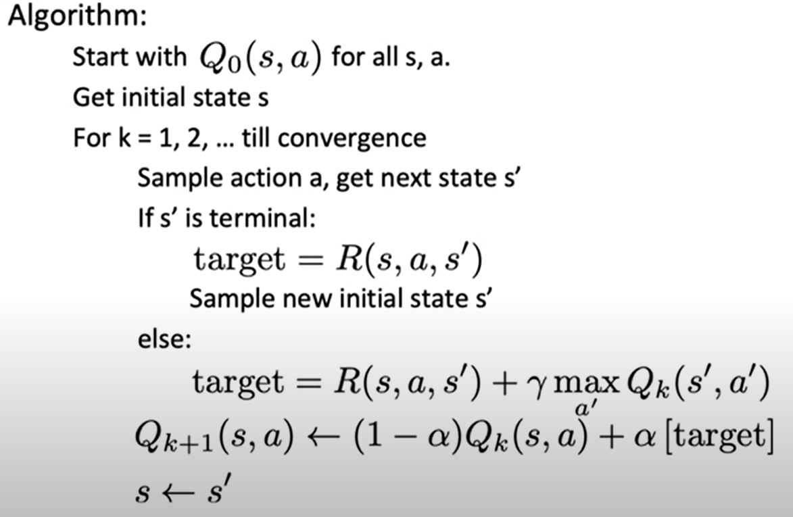
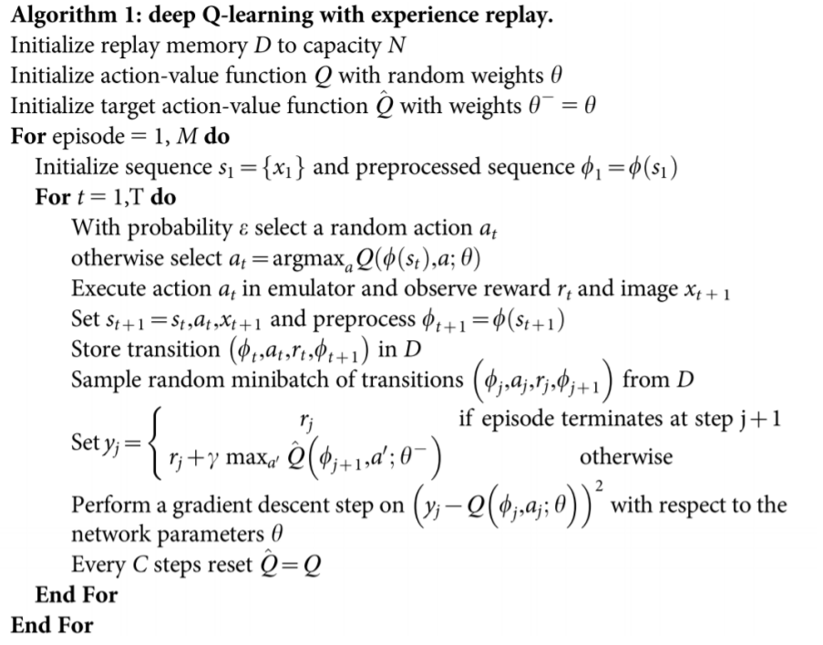
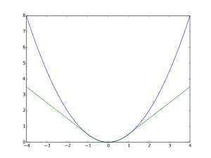

# Lezione 2 Pieter Abbeel - Deep Reinforcement Learning

Limitazioni dei metodi esatti:

- serve un modello dinamico: l'agente apprende il modello dinamico step-by-step, sampling based approximation
- serve iterare su tutte le azioni e tutti gli stati, rende la computazione impraticabile: Q/V function fitting tramite reti neurali

## Q-Learning

$Q^*(s,a)$: valore di utilità atteso per l'azione $a$ nello stato $s$ e agendo ottimamente dallo stato seguente in avanti.

Assume:

- accesso al transition model
- loop su azioni e stati

$$
Q_{k+1}^*(s,a) = \sum_{s'} P(s'|s,a)\cdot(R(s,a,s') + \gamma \max_{a'} Q_k^*(s',a'))
$$

Riscrittura tramite expected value, quindi usare l'esperienza, e non un transition model:

$$
Q_{k+1} = E_{s' \sim P(s'|s,1)} \left[ R(s,a,s') + \gamma \max_{a'} Q_k(s',a')) \right]
$$

Da ciò, l'idea dell'algoritmo:

- per la coppia $(s,a)$ considera uno stato sample $s' \sim P(s'|s,a)$
- considera $Q_k(s,a)$ stima precedente
- calcola la nuova stima come

$$
target(s') = R(s,a,s') + \gamma \max_{a'} Q_k(s',a')
$$

- incorpora la stima in una running average

$$
Q_{k+1}(s,a) = (1-\alpha) \cdot Q_{k}(s,a) + \alpha \cdot target(s')
$$

Algoritmo di Q-Learning:

**Come fare sampling sulle azioni?**

- sample greedy su $Q_k(s,a)$: non permette esplorazione
- $\epsilon$-greedy: scegli un'azione random con probabilità $\epsilon$, altrimenti scegli in maniera greedy; reintroduce un elemento di casualità

Osservazioni Q-Learning:

- $\alpha$ è interpretabile come un learning rate
- Q-Learning converge ad una optimal policy, anche se si sta agendo in maniera subottimale: **off-policy learning**
- problemi:
  - bisogna esplorare abbastanza
  - il learning rate deve decadere nel tempo altrimenti si continua a scegliere in maniera troppo casuale
  - non bisogna farlo decrescere troppo in fretta
- ogni stato e azione è visitato infinite volte: asintoticamente, non ha importanza che azione scegliamo
- il learning rate deve essere impostato in modo che valgano le seguenti condizioni:

$$

\begin{aligned}
&\sum_{t=0}^\infty \alpha_t(s,a)=\infty \qquad (\text{abbastanza apprendimento }\forall t)\\
& \sum_{t=0}^\infty \alpha_t^2(s,a)<\infty \qquad (\text{varianza limitata})
\end{aligned}
$$

Esempio: box robot; stati continui, bisogna discretizzare

**I metodi tabulari sono scalabili? NO**. Es. umanoide: $10^{100}$ stati

## Approximate Q-Learning

Funzione parametrizzata $Q_\theta(s,a)$:

- può essere una funzione lineare nelle features

$$
Q_\theta(s,a) = (\theta_0,...,\theta_n)^T (f_0(s,a),...,f_n(s,a))
$$

- decision tree
- ...
- neural network

## Deep Q Networks (DQN)

$$
\begin{aligned}
& target(s')=R(s,a,s') + \gamma \max_{a'} Q_{\theta_k}(s',a')\\
& \theta_{k+1} = \theta_k - \alpha \nabla_{\theta_k} \underbrace{\left[ \frac{1}{2}(Q_\theta(s,a) - target(s'))^2 \right]}_{\text{squared error loss}}\\
\end{aligned}
$$

per evitare overfitting, si può fare training in batches.

Algoritmo:

Osservazioni:

- memoria $D$ di transizioni, non soltanto la transizione precedente
- $\phi_l(s_l)$: preprocessing dei frame al time step $l$; è necessario per calcolare ad esempio la velocità di un oggetto, impossibile da dedurre da un frame non processato
- si memorizzano delle informazioni in $D$: $(\phi_t,a_t,r_t,\phi_{t+1})$
- gli step di discesa del gradiente sono fatti previo sampling di un minibatch di esperienze passate in $D$ e poi ottimizzando tutti gli step nel minibatch
- $y_j$ è il $target(s')$: uguale a $r_j$ se porta ad un'azione conclusiva
- $\hat{Q}$ è usata per calcolare il target Q-value, mentre $Q$ è la funzione che stiamo realmente apprendendo: questa scelta stabilizza l'apprendimento
- quindi $\hat{Q}$ ha un lag, per evitare che il calcolo del target sia instabile

Dettagli:

- si usa la Huber Loss, e non una squared loss, in modo da creare un averaging, più che una forte ottimizzazione. La funzione di Huber è una parabola vicino al vertice, e una retta nelle regioni più esterne.

$$
L_\delta(a)= \left\{
\begin{array}{ll}
\frac{1}{2}a^2 & \qquad |a| \le \delta\\
\delta\left(|a|-\frac{1}{2}\delta\right) & \qquad \text{otherwise}
\end{array}
    \right.
$$

- si usa l'ottimizzatore RMSProp (Hinton) più che SGD; RMSProp fa un rescaling del gradiente. Funziona meglio in questo caso
- annealing di $\epsilon$: si parte da $\epsilon=1$ per arrivare a $\epsilon=0.1$ dopo il primo milione di frames

DQN sui giochi Atari:

- 29/49 giochi con performance uguali o superiori all'uomo
- usa architetture convoluzionali

**Double DQN:**

- c'è un upward bias su $\max_a Q(s,a;\theta)$
- per evitare questo problema, siccome si stanno già usando due funzioni Q diverse, si imparano due funzioni Q *separate* utilizzando rispettivamente i parametri $\theta$ e $\theta^-$:
  - $\theta$ ha lo scopo di selezionare la migliore azione (agisce sull'argmax)
  - $\theta^-$ ha lo scopo di calcolare il corretto valore target
- si può quindi spezzare la loss utilizzando le due funzioni separate:

$$
L_i(\theta_i) = E_{s,a,s',r,D} \left[ 
    r + \gamma Q(s',\arg \max_{a'}Q(s',a',\theta);\theta_i^-) - Q(s,a;\theta_i)  
     \right]^2
$$

**Prioritized experience replay:**

- scegliere transizioni con probabilità uniforme, quando si fa sampling, è subottimale
- si può scelgere di fare sampling di transizioni in proporziona al Bellman error
  
$$
\left|
    r + \gamma \max Q(s',a';\theta^-) - Q(s,a;\theta)  
     \right|
$$

- quindi si vanno a scegliere di più le transizioni in cui l'esperienza non concorda con il target calcolato: il risultato è un apprendimento molto più veloce

Variazioni DQN:

- Double DQN
- Prioritized Replay DDQN
- Dueling DQN
- Distributional DQN: non si impara il valore Q ma la distribuzione
- Noisy DQN: introduce una maggiore randomizzazione delle transizioni