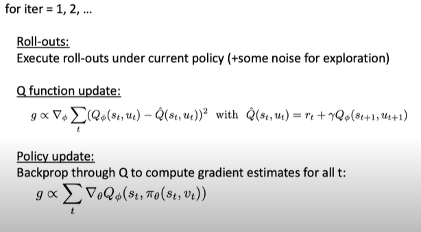

# Lezione 5 Pieter Abbeel - Deep Reinforcement Learning

Downside degli off-policy methods: non sampe-efficient: se collezionare dati è costoso, non sono metodi ideali

## Deep Deterministic Policy Gradient (DDPG)

Osservazioni:

- si aggiunge rumore per esporazione: la policy in questo algoritmo può essere deterministica
- si può stimare $Q$ con Monte Carlo o con Bootstrap: nell'immagine, bootstrap 1-step
- si ottimizza la policy: si shifta la policy in modo che il Q value venga migliorato
- in DDPG non si usa il likelihood-ratio, ma il Q value
- introducendo un replay buffer e idee di DQN si può aumentare stabilità
- si usa una versione con lag (Polyak-averaging) di $Q_\phi$ e $\pi_\theta$ per calcolare la stima $\hat{Q}$

$$
\hat{Q}_t = r_t + \gamma Q_{\phi'}(s_{t+1}, \pi_{\theta'}(s_{t+1}))
$$

Vantaggio: DDPG è più sample efficient di TRPO e PPO.

Svantaggio: spesso non è stabile.

## Soft Actor Critic (SAC)

Vantaggi:

- aggiunge entropia alla funzione obiettivo di DDPG: maximum-entropy formulation
- milgiore eplorazione e meno overfitting della policy su variazioni della Q-function

Soft policy iteration:

1) **soft policy evaluation**: fissando la policy, si fa un Bellman backup fino alla convergenza a $Q^\pi \ \equiv$ passo di SGD per minimizzare il Bellman residual

$$
Q(s,a) = r(s,a) + E_{s' \sim p_s, a' \sim \pi}[Q(s',a') \underbrace{- \log \pi(a'|s')}_{\text{entropy term}}]
$$

2) **soft policy improvement**: aggiorna la policy tramite proiezione di informazione. Si avrà $Q^{\pi_{new}} \ge Q^{\pi_{old}} \ \equiv$ passo di SGD per minimizzare la KL-divergence 

$$
\pi_{new} = \arg \min_{\pi'} D_{KL} \left( \pi'(\cdot | s) \left\| \frac{1}{Z} \exp Q^{\pi_{old}} (s, \cdot )\right. \right)
$$

3) **esegui un'azione** nell'ambiente e ripeti

Funzione obiettivo:

$$
J(\pi)=\sum_{t=0}^T E_{(s_t,a_t) \sim \rho_\pi} [ r(s_t, a_t) + \alpha H(\pi(\cdot | s_t))]
$$

Equazioni di update di V-value, Q-value, policy $\pi$:

$$
\begin{aligned}
J_V(\psi) &= E_{s_t \sim D} \left[ \frac{1}{2} (V_\psi(s_t) - E_{a_t \sim \pi_\phi}[Q_\theta(s_t,a_t)-\log \pi_\theta (a_t|s_t)])^2 \right]\\
\hat{Q}(s_t,a_t) &=r(s_t,a_t) + \gamma E_{s_{t+1} \sim p} [V_{\overline{\psi}}(s_{t+1})]\\
J_\pi(\psi) &= E_{s_t \sim D} \left[ D_{KL} \left( \pi_\phi (\cdot | s_t) \left\| \frac{\exp( Q_\theta(s_t, \cdot))}{Z_\theta(s_t)} \right. \right) \right] 
\end{aligned}
$$

Osservazione: SAC ha delle ottime learning curves nei robot reali, nei quali i dati sono estratti ad un rateo più basso quindi serve estrarre più informazioni possibili.