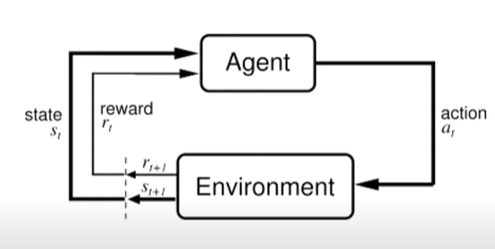
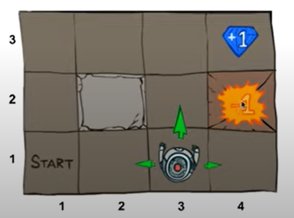
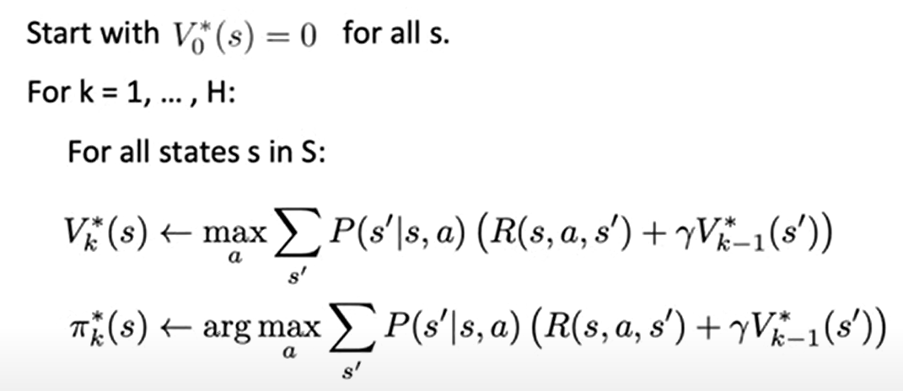
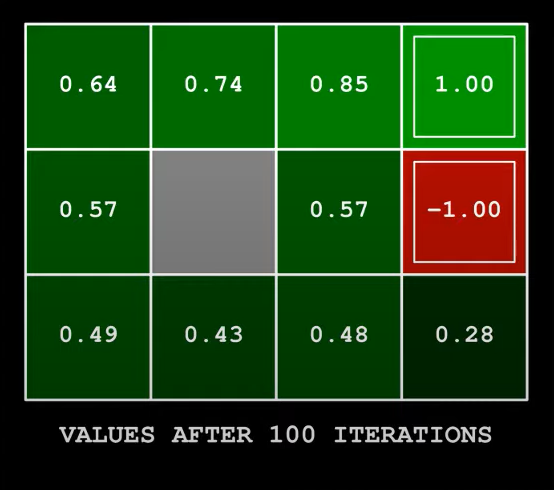
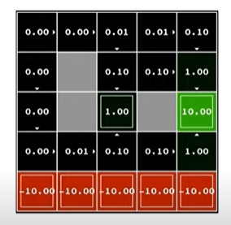
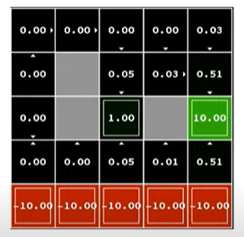
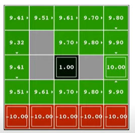
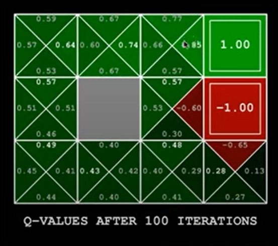
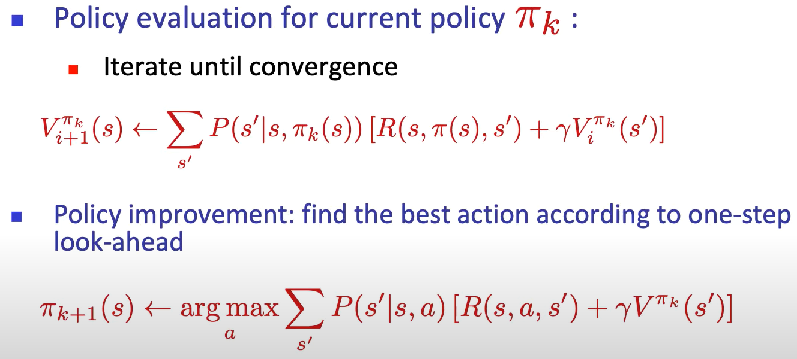

# Lezione 1 Pieter Abbeel - Deep Reinforcement Learning

## Motivation

- Atari (DQN), 2013, DeepMind
- 2D locomotion (TRPO), 2014, Berkley
- AlphaGo, 2015, DeepMind
- 3D locomotion (TRPO+GAE), 2016, Berkley
- Real Robot Manipulation (GPS), 2016, Berkley
- Dota2 (PPO), 2017, OpenAI
- DeepMimic, 2018, Berkley
- AlphaStar, 2019, DeepMind
- Rubik's Cube, 2019, OpenAI

---

## Markov Decision Process

**Markov Decision Process (definizione)**: Un Markov Decision Process è una settupla $(S,A,P,R,s_0,\gamma,H)$ tale che:

- $S$ è l'insieme degli stati
- $A$ è l'insieme di azioni
- $P(s'| s,a )$ è la probabilità di passare allo stato $s'$ dallo stato $s$ tramite l'azione $a$
- $R(a,s,s')$ è la reward function che indica la ricompensa nel passare dallo stato $s$ allo stato $s'$ tramite l'azione $a$
- $s_0$ è lo stato iniziale
- $\gamma$ è il *discount factor*, costante in $[0,1]$. Più $\gamma$ è piccolo, meno le azioni future hanno influenza sulla scelta dell'azione all'istante corrente
- $H$ è l'orizzonte, cioè il time-step nel futuro oltre il quale non si prosegue la computazione

Goal del MDP:

$$
\max_\pi E \left[ \left. \sum_{t=0}^H \gamma^tR(S_t, A_t, S_{t+1}) \right| \pi \right]
$$

Esempi di MDP:

- cleaning robot
- walking robot
- pole balancing
- tetris
- server management (parameter optimization, assignment)
- shortest path problems
- models for animals and people

---

## Value iteration

$$
V^*(s) = \max_\pi E \left[ \left. \sum_{t=0}^H \gamma^tR(S_t, A_t, S_{t+1}) \right| \pi, s_0 =s\right]
$$

Esempio Gridworld. Nota: appena l'agente ottiene una ricompensa (positiva o negativa) il processo termina.

Esempio $\gamma=1$, $H=100$:

- $V^*(4,3)=1$
- $V^*(3,3)=1$
- $V^*(2,3)=1$
- $V^*(1,1)=1$
- $V^*(4,2)=-1$

Esempio $\gamma=0.9$, $H=100$:

- $V^*(4,3)=1$
- $V^*(3,3)=0.9$
- $V^*(2,3)=0.9^2=0.81$
- $V^*(1,1)=0.9^5=0.59$
- $V^*(4,2)=-1$

Esempio $\gamma=0.9$, $H=100$ e **probabilità di successo delle azioni pari a** $0.8$:

- $V^*(4,3)=1$
- $V^*(3,3)=0.8 \cdot 0.9 \cdot V^*(4,3)+0.1 \cdot 0.9V^*(3,3)+0.1 \cdot 0.9 \cdot V^*(3,2)$ ,... **ricorsione**

Computazione di $V_t^*(s)$ :

$$
\left\{
\begin{aligned}
& V_0^*(s)=0 \qquad \forall s \vphantom{\sum^k_b} \\
& V_k^*(s)= \max_a \sum_{s'} P(s'|s,a)\cdot  ( R(s,a,s') + \gamma V_{k-1}^*(s')) \qquad k > 0 \phantom{\sum^k}
\end{aligned}
\right.
$$

Algoritmo:

Si può ricostruire ciascuna azione per ogni stato con il Bellman backtrace oppure aggiornando ad ogni passo l'azione ottimale.

Esempio con noise $0.2$ e discout $0.9$:

**Teorema**: Value iteration converge al valore ottimo della funzione $V^*$ per il *discounted infinite horizon problem*, che soddisfa le equazioni di Bellman:

$$
V^*(s)= \max_a \sum_{s'} P(s'|s,a)\cdot  ( R(s,a,s') + \gamma V^*(s')), \qquad \forall s \in S
$$

Alla convergenza (per ogni $s \in S$, $V^*(s)= \lim _{k \rightarrow \infty} V_k^*(s)$) si ha:

- $\pi^*(s)= \arg \max_a \sum_{s'} P(s'|s,a)\cdot  ( R(s,a,s') + \gamma V^*(s'))$ piano ottimale
- la *infinite horizon optimal policy* è un processo stazionario, quindi per ogni stato $s$, il valore $V_k^*(s)$ è uguale per ogni time-step $k$, quindi richiede di memorizzare un solo valore e non un valore per ogni time-step

**Intuizione sulla convergenza di Value iteration**:

- assunzione semplificatrice: i reward sono tutti maggiori di $0$. Si può ragionare su reward negativi considerando il valore assuluto di $R$
- $V^*(s)$ somma attesa delle ricompense dallo stato $s$ dopo infiniti step
- $V_H^*(s)$ somma attesa delle ricompense dallo stato $s$ dopo $H$ step
- reward addizionali dopo $H$:

$$
\sum_{k=1}^\infty \gamma^{H+k} R(s_{H+k}) \le R_{max} \cdot \sum_{k=1}^\infty \gamma^{H+k}  \stackrel{(*)}{=} \frac{\gamma^{H+1}}{1-\gamma}R_{max} \qquad (*) \text{ serie geometrica}
$$

Siccome $\gamma < 1$ si ha che $\lim_{H \rightarrow \infty}\frac{\gamma^{H+1}}{1-\gamma}R_{max} = \frac{R_{max}}{1-\gamma}$, quindi $V_H^*$ converge a $V^*$

**Intuizione sulla convergenza di Value iteration con contractions**:

- $\| U(s)\| = \max_s |U(s)|$
- $\gamma$-contraction: $\forall U_i,V_i. \ \| U_{i+1} - V_{i+1} \| \le \| U_i - V_i \|$
- teorema: una contraction converge ad un valore unico
- fatto: Value iteration è una $\gamma$-contraction in max-norm
- corollario: Value iteration converge ad un valore unico
- fatto: $\| V_{i+1} - V_i \| < \epsilon$ quindi $\| V_{i+1} - V^* \| < 2\epsilon/(1-\gamma)$, quindi quando l'update è piccolo è vicino alla convergenza

### Esempi

$\gamma = 0.1, noise=0 \quad \Longrightarrow \quad$ preferisci l'uscita vicina, rischiando la rupe

$\gamma = 0.1, noise=0.5 \quad \Longrightarrow \quad$ preferisci l'uscita vicina, non rischiando la rupe

$\gamma = 0.1, noise=0 \quad \Longrightarrow \quad$ preferisci l'uscita lontana, rischiando la rupe

$\gamma = 0.1, noise=0 \quad \Longrightarrow \quad$ preferisci l'uscita lontana, non rischiando la rupe

---

## Q-values

**Definizione (Q-values)**: $Q^*(s,a)$ valore atteso di utilità partendo da $s$ e commettendo l'azione $s$, e poi agendo ottimalmente. Equazione di Bellman:

$$
Q^*(s,a) = \sum_{s'} P(s'|s,a)\cdot(R(s,a,s') + \gamma \max_{a'} Q^*(s',a'))
$$

Q-value iteration:

$$
Q_k^*(s,a) = \sum_{s'} P(s'|s,a)\cdot(R(s,a,s') + \gamma \max_{a'} Q_{k-1}^*(s',a'))
$$

Q-value converge nello stesso modo con cui converge Value iteration.

Esempio:

---

## Policy iteration

*Policy evaluation*: si utilizza la stessa equazione di Value iteration, ma non scegliendo l'azione che massimizza il valore, bensì un'azione di un particolare piano $\pi$.

Valutazione di una policy deterministica:

$$
V_k^\pi(s) = \sum_{s'} P (s'|s,\pi(s))\cdot (R(s,\pi(s),s')+\gamma V_{k-1}^\pi(s))
$$

Alla convergenza:

$$
V^\pi(s) = \sum_{s'} P (s'|s,\pi(s))\cdot (R(s,\pi(s),s')+\gamma V^\pi(s))
$$

Stochastic policy: $\pi(a|s)$ probabilità di commettere l'azione $a$ nello stato $s$. Valutazione:

$$
V_k^\pi(s) = \sum_{s'} \sum_{a} \pi(a|s)\cdot P(s'|s,a) \cdot (R(s,a,s') + \gamma V_{k-1}^\pi(s'))
$$

Si può utilizzare la policy evaluation come misura di qualità di una policy, e cercare nello spazio delle policy la migliore.

**Algoritmo di policy iteration:**

Osservazioni:

- per ogni stato $s$
- fissata una policy $\pi_k$, si fa policy evaluation ($\simeq$ complessità di value iteration)
- dopo aver valutato la polici, si calcola una policy migliorata
- si ripete finché la policy non converge
- sotto alcune condizioni, converge più velocemente di Value iteration

**Teorema (convergenza e ottimalità di policy iteration)**: Policy iteration converge e la valutazione della policy trovata è ottimale.

**Convergenza**:

- in ogni step la policy migliora
- ci sono un numero finito di policy $|A|^{|S|}$

**Ottimalità**:

- quando si ha convergenza si ha $\pi_{k+1}(s)=\pi_k(s)$ per ogni $s$, quindi vale la condizione 

$$
\pi(s) = \arg \max_a  \sum_{s'} P(s,a,s') \cdot (R(s,a,s') + \gamma V^\pi(s')) \qquad \forall s
$$

equazione di Value iteration. Sapendo che Value iteration trova il valore ottimale, abbiamo dimostrato l'ottimalità della policy alla convergenza di Policy iteration.

---

## Maximum Entropy Formulation

Motivazioni:

- se volessimo avere una distribuzione tra le policy, che ci permetta di identificare le migliori?
- otteniamo un learning più robusto: la ricerca rimane più stocastica, e si adatta ai cambiamenti dell'ambiente
- su problemi reali, si ha interleaving tra collezione di dati e calcolo delle policy, quindi diventa difficile calcolare soluzioni esatte
- la formulazione seguente, fornisce una maggiore variazione, che rende più interessante la raccolta di informazioni

Entropia:

- misura di incertezza su una variabile casuale $X$ che indica il numero di bit per codificare $X$

$$
H(X)=-\sum_i P(X=x_i) \log P(X=x_i)
$$

Formulazione classica MDP:

$$
\max_\pi E\left[\sum_{t=0}^H r_t  \right]
$$

Maximum entropy MDP:

$$
\max_\pi E\left[\sum_{t=0}^H r_t + \beta H(\pi(\cdot|s_t)) \right]
$$

si introduce un termine che punta a massimizzare l'entropia. In particolare, più alto è $\beta$, più l'ottimizzazione è focalizzata sul massimizzare l'entropia, quindi che risulterebbe nella raccolta di meno reward. Alta entropia implica alta stocasticità.

**Ottimizzazione del problema con maximum entropy formulation:**

Calcolo del duale lagrangiano:
$$
\begin{aligned}
& \max_{\pi(a)} \left \{ E[r(a)] + \beta H(\pi(a)) \left| \ \sum_{a'} \pi(a')=1 \right. \right\}\\
& \max_{\pi(a)} \left\{ E[r(a)] - \beta \sum_{a'} \pi(a') \log \pi(a') \left| \ \sum_{a'} \pi(a')=1 \right. \right\} \\
& \max_{\pi(a)} \min_\lambda \mathcal{L}(\pi(a),\lambda)= E[r(a)] - \beta \sum_{a'} \pi(a') \log \pi(a') + \lambda \left( \sum_{a'} \pi(a')-1 \right)
\end{aligned}
$$

Calcolo del massimo di $\mathcal{L}$ rispetto a $\pi(a)$:
$$
\begin{aligned}
& \frac{\partial}{\partial \pi(a)}\mathcal{L}(\pi(a),\lambda)=0\\
& \frac{\partial}{\partial \pi(a)} \left(\sum_{a'} \pi(a')r(a') - \beta \sum_{a'} \pi(a')\log \pi(a') + \lambda \left( \sum_{a'} \pi(a')-1\right) \right)=0\\
& r(a)- \beta \log \pi(a) - \beta + \lambda = 0\\
& \beta \log \pi(a) = r(a) - \beta + \lambda\\
& \pi(a) = \exp \left( \frac{1}{\beta}(r(a) - \beta + \lambda) \right)
\end{aligned}
$$

Calcolo del minimo di $\mathcal{L}$ rispetto a $\lambda$:
$$
\begin{aligned}
& \frac{\partial}{\partial \lambda} \mathcal{L}(\pi(a), \lambda) = 0\\
& \sum_a \pi(a) - 1= 0\\
\end{aligned}
$$
si ottiene che qualsiasi $\lambda > 0$ permette di ottenere il minimo. Ponendo $\lambda = \beta$ e normalizzando:

$$
\pi(a) = \frac{1}{Z} \exp \left( \frac{1}{\beta}r(a) \right), \qquad Z = \sum_a \exp \left( \frac{1}{\beta}r(a) \right)
$$

la normalizzazione è accettabile perché monotona crescente.

Osservazioni:

- come si può notare dalla formula della policy ottima, più è alto il valore di $\beta$, più la distribuzione di probabilità sulle azioni è una distribuzione uniforme
- se invece $\beta$ è basso, diventa più probabile l'azione che colleziona più reward

Valore $V$ associato alla policy $\pi(a)$:

$$
\begin{aligned}
V &= \sum_a \left[ \frac{1}{Z}\exp \left( \frac{1}{\beta}r(a) \right) r(a) \right] - \beta \sum_a \frac{1}{Z}\exp \left( \frac{1}{\beta}r(a) \right)  \log \left[ \frac{1}{Z}\exp \left( \frac{1}{\beta}r(a) \right)  \right ]\\
&= \sum_a \frac{1}{Z} \exp \left( \frac{1}{\beta} r(a) \right) \underbrace{\left[ r(a) - \beta \log \left( \exp\left(\frac{1}{\beta}r(a)\right) \right)\right]}_0 - \beta \log \frac{1}{Z}\underbrace{ \sum_a \frac{1}{Z} \exp \left( \frac{1}{\beta}r(a) \right)}_1\\
&= - \beta \log \frac{1}{Z}\\
&= \beta \log \sum_a \exp \left( \frac{1}{\beta}r(a) \right) \equiv \text{softmax}
\end{aligned}
$$

One-step update di max-ent value iteration:

$$
V_k(s)=\max_\pi E \left[ \sum_{t=H-k}^H r(s_t,a_t) + \beta H(\pi(a_t|s_t)) \right]
$$

$$
\begin{aligned}
V_k(s)&=\max_\pi E \left[ r(s,a,s') + \beta H(\pi(a|s)) + V_{k-1}(s') \right]\\
&=\max_\pi E \left[ Q_k(s,a) + \beta H(\pi(a|s)) \right]\\
\end{aligned}
$$

che equivale a sostituire $r(a)$ al posto di $Q_k(s,a)$ nella formulazione del problema di ottimizzazione. Si ottiene quindi

$$
V_k(s) = \beta \sum_a \exp \left( \frac{1}{\beta} Q_k(s,a) \right), \qquad \pi_k(s) = \frac{1}{Z} \exp \left( \frac{1}{\beta} Q_k(s,a) \right)
$$