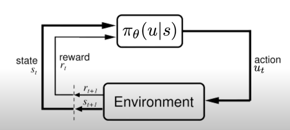
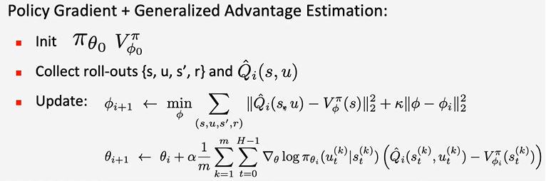

# Lezione 3 Pieter Abbeel - Deep Reinforcement Learning

Metodi alternativi a DQN per risolvere grandi MDP:

- DQN è data-efficient, ma magari non stabile come altri metodi
- ogni metodo ha i suoi use-cases 

## Policy Gradient derivation

- in Policy Gradient Methods l'agente è una rete neurale
- sceglie l'azione in base a stati e reward, e i pesi $\theta$
- la rete operererà l'ottimizzazione $\max_\theta E\left[ \left. \sum_{t=0}^H R(s_t) \right| \pi_\theta \right]$
- spesso si preferiscono policy stocastiche $\pi_\theta(u|s)$, in modo da avere una pianificazione più smooth
- la stocasticità aiuta l'agente a esplorare il mondo
- la rete restituisce una distribuzione sulle azioni

Perché policy optimization:

- $\pi$ può essere più semplice di calcolare i Q-values o i V-values
- i V-values non prescrivono un'azione: serve un modello dinamico, quindi almeno calcolare 1 Bellman backup
- i Q-values richiedono di calcolare in maniera effiiciente $\arg \max_u Q_\theta(s,u)$, il che costituisce una sfida per spazi di azioni grandi o continui

**Likelihood ration policy gradient**: $\tau$ denota la sequenza stato-azione $s_0, u_0, ..., s_H, u_H$. Con un abuso di notazione, si indica $R(\tau)=\sum_{t=0}^HR(s,u)$. Il reward atteso si può dunque esprimere come 

$$
U(\theta)=E\left[ \sum_{t=0}^H R(s,u) ; \pi_\theta \right]=E\left[ R(\tau) ; \pi_\theta \right] = \sum_\tau P(\tau; \theta)R(\tau)
$$

quindi la funzione obiettivo diventa

$$
\max_\theta U(\theta)=\max_\theta \sum_\tau P(\tau; \theta)R(\tau)
$$

Ottimizzazione con gradiente:

$$
\begin{aligned}
\nabla_\theta U(\theta) &= \nabla_\theta \sum_\tau P(\tau; \theta) R(\tau)\\
&=  \sum_\tau \nabla_\theta P(\tau; \theta) R(\tau) & \text{($R$ non dipende da $\theta$)}\\
&=  \sum_\tau \frac{P(\tau; \theta)}{P(\tau; \theta)} \nabla_\theta P(\tau; \theta) R(\tau)  & \text{(obiettivo: somma pesata da $P$)}\\
&=  \sum_\tau P(\tau; \theta) \underbrace{\left(\frac{1}{P(\tau; \theta)}\nabla_\theta P(\tau; \theta) \right)}_{\nabla_\theta \log P(\tau; \theta)} R(\tau)\\
&=  \sum_\tau P(\tau; \theta) \nabla_\theta \log P(\tau; \theta) R(\tau) & \text{(chain rule)}\\
\end{aligned}
$$

Approssimando la misura ottenuta con $m$ traiettorie campione sulla policy $\pi_\theta$, si ottiene:

$$
\nabla_\theta U(\theta) \approx \hat{g} = \frac{1}{m} \sum_{i=1}^m \nabla_\theta \log P(\tau^{(i)}; \theta)R(\tau^{(i)})
$$

Osservazioni:

- non dobbiamo prendere la derivata della funzione reward, quindi il reward può essere una funzione qualsiasi, anche discontinua
- $R$ può essere una funzione discreta
- siccome si sta massimizzando $U(\theta)$, il gradiente fa si che il prossimo $\theta$ calcolato aumenti la probabilità delle traiettorie con alto reward, mentre diminuisca la probabilità per le traiettorie con basso reward (siccome si ha una distribuzione di probabilità)

Bisogna ancora calcolare il gradiente della probabilità.

## Temporal decomposition

Decomposizione su traiettorie non complete: analisi locale.

$$
\begin{aligned}
\nabla_\theta \log P(\tau^{(i)}; \theta)&= \nabla_\theta \log \left ( \prod_{t=0}^H P\left(s_{t+1}^{(i)} \left| s_{t}^{(i)}, u_{t}^{(i)} \right.\right) \cdot \pi_\theta \left(u_{t}^{(i)}\left|s_{t}^{(i)}\right.\right) \right) & \text{(decomposizione $\tau$)}\\
&= \nabla_\theta \left ( \sum_{t=0}^H \log P\left(s_{t+1}^{(i)} \left| s_{t}^{(i)}, u_{t}^{(i)} \right.\right) + \sum_{t=0}^H \log \pi_\theta \left(u_{t}^{(i)}\left|s_{t}^{(i)}\right.\right) \right) & \text{(prop. $\log$)}\\
&= \nabla_\theta \sum_{t=0}^H \log \pi_\theta \left(u_{t}^{(i)}\left|s_{t}^{(i)}\right.\right) & \text{(dynamic model non dipende da $\theta$)}\\
&= \sum_{t=0}^H \nabla_\theta  \log \pi_\theta \left(u_{t}^{(i)}\left|s_{t}^{(i)}\right.\right) \\
\end{aligned}
$$

Osservazione:

- per aumentare la probabiltà di una traiettoria dobbiamo aumentare la probabilità delle azioni lungo quella traiettoria
- il modello dinamico non influisce nella ottimizzazione: vantaggio, perché in questo modo possiamo eseguire il calcolo senza conoscere il modello dinamico

Unbiased estimate del gradiente implica $E[\hat{g}]=\nabla_\theta U(\theta)$:

$$
\hat{g} = \frac{1}{m} \sum_{i=0}^m \nabla_\theta \log P(\tau^{(i)}; \theta) R(\tau^{(i)}), \qquad \text{con} \quad \nabla_\theta \log P(\tau^{(i)}; \theta) = \sum_{t=0}^H \nabla_\theta  \log \pi_\theta \left(u_{t}^{(i)}\left|s_{t}^{(i)}\right.\right)
$$

Osservazioni sulla formulazione corrente:

- già usabile
- unbiased ma molto rumorosa (alta varianza). Fix per uso reale:
  - si introdurrà una baseline, si userà più struttura temporale e si introddurranno i concetti di *trust region* e *natural gradient*

Altra idea:

- aumentare la probabilità di reward sopra la media, e diminuire quelli sotto la media
- in questo modo, le traiettorie con alto reward non dominano pesantemente l'ottimizzazione come invece fanno nella formulazione indicata fin'ora

## Baseline subtraction

Si considera una baseline $b$ da sottrarre ai reward nella funzione obiettivo. La scelta di $b$ determina quali probabilità sono aumentate e quali sono diminuite.

$$
\nabla_\theta U(\theta) \approx \hat{g} = \frac{1}{m} \sum_{i=0}^m \nabla_\theta \log P(\tau^{(i)}; \theta) R(\tau^{(i)}-b)
$$

Calcolo della media del termine con $b$:

$$
\begin{aligned}
E \left[\nabla_\theta \log P(\tau^{(i)}; \theta) \cdot b \right] &= \sum_\tau P(\tau; \theta) \nabla_\theta \log P(\tau^{(i)}; \theta) b\\ 
&= \sum_\tau P(\tau; \theta) \frac{\nabla_\theta P(\tau^{(i)}; \theta)}{P(\tau^{(i)}; \theta)} b & \text{(chain rule)}\\
&= \sum_\tau \nabla_\theta P(\tau; \theta) b\\
&= \nabla_\theta \left ( \sum_\tau  P(\tau; \theta) b \right)\\
&= b \nabla_\theta \left ( \sum_\tau  P(\tau; \theta) \right) & \text{(assume che $b$ non dipenda da $\theta$)}\\
&= b \cdot 0\\
\end{aligned}
$$

Osservazione: nella media, il termine dato da $b$ è $0$. In realtà, con campioni finiti, si ha un effetto di riduzione della varianza.

Decomposizione teporale del reward:

$$
\begin{aligned}
\hat{g} &= \frac{1}{m} \sum_{i=0}^m \nabla_\theta \log P(\tau^{(i)}; \theta) R(\tau^{(i)}-b)\\
&= \frac{1}{m} \sum_{i=0}^m \left( \sum_{t=0}^{H-1}\nabla_\theta \log \pi_\theta(u_t^{(i)}| s_t^{(i)})\right) \left( \sum_{t=0}^{H-1} R(s_t^{(i)}, u_t^{(i)}) - b\right)\\
&= \frac{1}{m} \sum_{i=0}^m \left( \sum_{t=0}^{H-1}\nabla_\theta \log \pi_\theta(u_t^{(i)}| s_t^{(i)})\right) \left( \underbrace{\sum_{k=0}^{t-1} R(s_k^{(i)}, u_k^{(i)})}_{\text{azioni passate}} +  \underbrace{\sum_{k=t}^{H-1} R(s_k^{(i)}, u_k^{(i)})}_{\text{azioni future}} - b\right)\\
\end{aligned}
$$

Osservazioni:

- i reward delle azioni passate non hanno influenza. Si può dimostrare che l'expected reward delle azioni passate al tempo $t$ è $0$
- solo le azioni future sono considerate
- la baseline $b$ può essere imposta come dipendente dallo stato corrente $s_t^{(i)}$

Si rimuovono termini non dipendenti, in modo da ridurre la varianza, e si ottiene l'equazione usata nella pratica:

$$
\hat{g}= \frac{1}{m} \sum_{i=0}^m  \sum_{t=0}^{H-1}\nabla_\theta \log \pi_\theta(u_t^{(i)}| s_t^{(i)}) \left( \sum_{k=t}^{H-1} R(s_k^{(i)}, u_k^{(i)})- b(s_t^{(i)})\right)\\
$$

Quindi si aumenta la probabilità di azioni che permettono di accumulare un reward futuro alto rispetto alla baseline.

**Buone scelte per $b$**:

- constant baseline:

$$
b = E[R(\tau)] \approx \frac{1}{m} \sum_{i=1}^m R(\tau^{(i)})
$$

- optimal constant baseline: non usata fin'ora a livello implementativo. Pesa i reward con le norme al quadrato dei gradienti, quindi favorisce i reward che derivano da traiettorie con gradienti con norma grande.

$$
b = \frac{\sum_i (\nabla_\theta \log P(\tau^{(i)};\theta))^2 R(\tau^{(i)})}{\sum_i (\nabla_\theta \log P(\tau^{(i)};\theta))^2}
$$

- time-dependent baseline: molto popolare. Se siamo ad un time-step vicino all'orizzonte, abbiamo meno reward rimanente

$$
b_t = \frac{1}{m} \sum_{i=1}^m \sum_{k=t}^{H-1} R(s_k^{(i)},u_k^{(i)})
$$

- state-dependent expected return: molto preciso. Praticamente una V-value function, ma bisogna calcolarla su un problema di grande scala. Quindi si aumentano le proabilità di quelle traiettorie che performano meglio di quelle date dalla valutazione con V-value della policy corrente.
$$
b(s_t) = E\left[ \sum_{k=t}^{H-1} r_k\right] = V^\pi(s_t)
$$

## Value function estimation

Bisogna stimare la funzione V, per evitare il calcolo esatto.

$$
\hat{g}= \frac{1}{m} \sum_{i=0}^m  \sum_{t=0}^{H-1}\nabla_\theta \log \pi_\theta(u_t^{(i)}| s_t^{(i)}) \left( \sum_{k=t}^{H-1} R(s_k^{(i)}, u_k^{(i)})- V^\pi (s_t^{(i)})\right)\\
$$

### 1) Monte Carlo estimation di $V^\pi$

Regressione: calcolo con una rete neurale della funzione $V^\pi_\phi$ che minimizza l'errore quadratico:

- inizializza $V_{\phi_0}^\pi$
- colleziona le traiettorie $\tau_0,\tau_1, ...,\tau_m$
- passo di regressione:

$$
\phi_{i+1} = \arg \min_\phi \frac{1}{m}\sum_{i=1}^m \sum_{t=0}^{H-1} \left( V_\phi^\pi (s_t^{(i)})  - \left( \sum_{k=t}^{H-1} R(s_k^{(i)},u_k^{(i)}) \right)\right)^2
$$

Metodo semplice basato sulla regressione. Si può anche usare la Huber loss.

### 2) Bootstrapping estimation di $V^\pi$

Training neurale della V-value function usando l'equazione di Bellman update:

- inizializza $V_{\phi_0}^\pi$
- colleziona i dati $\{s,u,s',r\}$
- passo di fitting:

$$
\phi_{i+1} = \min_\phi \sum_{(s,u,s',r)} \| r+V_{\phi_i}^\pi(s') - V_\phi(s)\|_2^2 + \lambda\| \phi - \phi_i \|_2^2
$$

Si esegue anche regolarizzazione per evitare update troppo grandi. Si può anche fare update in batch.

## Vanilla Policy Gradient

Advantage estimate $\hat{A}_t$: differenza reward futuro e baseline.

Per la baseline, a volte si parte con Monte Carlo, e poi da una certa iterazione in poi si usa Bootstrapping.

## Andvantage estimation

Vogliamo raffinare la stima del reward futuro, non più un singolo esempio ma una stima con varianza sperabilmente minore.

$$
\hat{g}= \frac{1}{m} \sum_{i=0}^m  \sum_{t=0}^{H-1}\nabla_\theta \log \pi_\theta(u_t^{(i)}| s_t^{(i)}) \left( \underbrace{\sum_{k=t}^{H-1} R(s_k^{(i)}, u_k^{(i)})}_{\text{stima di }Q^\pi} - V^\pi (s_t^{(i)})\right)\\
$$

Stima di $Q^\pi(s,u)=E\left[ \left. \sum_{t=0}^H r_t \right| s_0=s, a_0=u\right]$: alta varianza per sample, nessuna generalizzazione.

Riduzione della varianza:

- tramite discounting
- tramite function approximation.

**Ma il discount factor non è un parametro del MDP**? Si ma si può usare come iperparametro. Cattura l'idea che le azioni molto avanti nel futuro hanno poca influenza nella scelta dell'azione al tempo $t$.

Stima del Q-value $\hat{Q}:$

$$
\begin{aligned}
& Q^\pi(s,u)=E\left[ \left. \sum_{t=0}^H \gamma^tr_t \right| s_0=s, a_0=u\right] & \text{(zero bias, alta varianza)}\\
& Q^\pi(s,u)=E\left[ \left. r_0 + \gamma V^\pi(s_1)\right| s_0=s, a_0=u\right] & \text{(alto bias, bassa varianza)}\\
& Q^\pi(s,u)=E\left[ \left. \left( \sum_{t=0}^{k-1} \gamma^tr_t \right) + \gamma^k V^\pi(s_k) \right| s_0=s, a_0=u\right] & \text{(tradeoff)}\\
\end{aligned}
$$

Esempi in letteratura:

- A3C: $k=5$
- GAE (Generalized Advantege Estimation): media esponenziale di valori di $k$ diversi (~TD lambda, altro lavoro)

## Policy gradient con A3C o GAE

Ci sono tante variazioni dell'algoritmo:

- A3C o GAE per $\hat{Q_i}$
- si può usare 1-step per V, e full roll-out per $\pi$

Risultati:

- A3C performa meglio di DQN in termini di tempo, e probabilmente anche per numero di esempi processati
- DQN ha più informazioni ma è più costoso computazionalmente

Osservazioni:

- gli iperparametri $\gamma$ e $\lambda$ (media esponenziale GAE) sono fondamentali per trovare l'ottimo