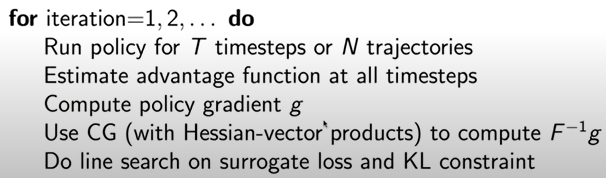
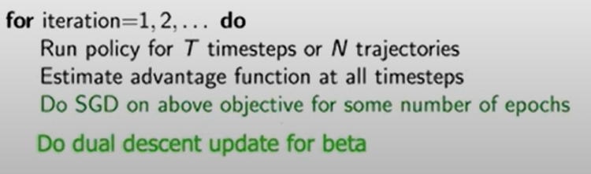

**[< Torna all'indice dei conenuti](../index.md)**

# Lecture 4 - TRPO and PPO

Come rendere ancora migliore Policy Gradient.

## Surrogate loss

Si modifica la funzione obiettivo per qualsiasi $\theta_{old}$ rispetto a dati ottenuti fin'ora. Se utilizziamo $\theta=\theta_{old}$ abbiamo un meccanismo standard policy gradient.

$$
U(\theta) = E_{r \sim \theta_{old}} \left[ \frac{P(\tau|\theta)}{P(\tau|\theta_{old})} R(\tau)\right]\\
\\
 \qquad \text{così che } E_{r \sim \theta_{old}} \left[ \frac{P(\tau|\theta)}{P(\tau|\theta_{old})} R(\tau)\right] = P(\tau|\theta_{old})\frac{P(\tau|\theta)}{P(\tau|\theta_{old})}R(\tau)= P(\tau|\theta)R(\tau)
$$

Calcolo del gradiente:

$$
\begin{aligned}
\nabla_\theta U(\theta) &= E_{r \sim \theta_{old}} \left[ \frac{\nabla_\theta P(\tau|\theta)}{P(\tau|\theta_{old})} R(\tau)\right]\\
\nabla_\theta U(\theta) |_{\theta=\theta_{old}} &= E_{r \sim \theta_{old}} \left[ \frac{\nabla_\theta P(\tau|\theta) |_{\theta=\theta_{old}}}{P(\tau|\theta_{old})} R(\tau)\right]\\
&= E_{r \sim \theta_{old}} \left[ \nabla_\theta \log P(\tau|\theta) |_{\theta=\theta_{old}} R(\tau)\right]
\end{aligned}
$$

## Step-sizing and Trust Region Policy Optimization (TRPO)

Step-sizing è importante perché il gradiente è un'approssimazione di primo ordine, guarda localmente dove è meglio muoversi. Bisogna capire quanto andare verso la direzione del gradiente.

**Cosa succede se si ha uno step-size troppo grande?**

- apprendimento supervisionato: si può correggere nel prossimo update
- reinforcement learning: uno step troppo avanti corrisponde ad una policy di qualità bassa
  - i prossimi dati collezionati saranno poco informativi
  - non c'è un modo per correggere lo step-size in maniera ottimale
  - c'è modo di trovare lo step size ideale?

Step-sizing con ricerca lineare nella direzione del gradiente:

- si collezionano dati su lunghezze diverse del gradiente
- naive: non valuta la bontà dell'approssimazione di prim'ordine

### TRPO (Trust Region Policy Optimization)

$$
\begin{aligned}
\max_\pi \ & L(\pi) = E_{\pi_{old}} \left[ \frac{\pi(a|s)}{\pi_{old}(a|s)} A^{\pi_{old}}(s,a) \right]\\
\text{s.t.} \ & E_{\pi_{old}}[KL(\pi \| \pi_{old})] < \epsilon
\end{aligned}
$$

Osservazioni:

- si usa la surrogate loss
- si collezionano dati dalla old policy
- la loss function valuta la nuova policy senza collezionare altri dati
- stima $A^{\pi_{old}}$ dipende dalla old policy
- il metodo è buono quando la nuova policy è vicino alla vecchia policy
- $KL(\pi \| \pi_{old})$ distanza delle policy sotto forma di *Kullback-Leibler divergence* (calcolo di quanto due distribuzioni di probabilità differiscono tra di loro): si può usare il metodo del gradiente coniugato per calcolarla, siccome è di ordine superiore
- regione KL: ancora da definire

Algoritmo TRPO:

Calcolo di KL:

Recall calcolo probabilità traiettoria: $P(\tau ; \theta) = P(s_0) \prod_{t=0}^{H-1} \pi_\theta(u_t|s_t) P(s_{t+1}|s_t,u_t)$

Calcolo approssimato della Kullback-Leibler divergence (KL):

$$
\begin{aligned}
KL(P(\tau ; \theta) \| P(\tau ; \theta + \delta \theta)) &= \sum_\tau P(\tau; \theta) \log \frac{P(\tau; \theta)}{P(\tau; \theta + \delta \theta)} & \text{(def. KL-divergence)}\\

&= \sum_\tau P(\tau; \theta) \log \frac{P(s_0) \prod_{t=0}^{H-1} \pi_\theta(u_t|s_t) P(s_{t+1}|s_t,u_t)}{P(s_0) \prod_{t=0}^{H-1} \pi_{\theta + \delta \theta}(u_t|s_t) P(s_{t+1}|s_t,u_t)} & \text{(def. $P(\tau ; \theta)$)}\\
&= \sum_\tau P(\tau; \theta) \log \frac{\prod_{t=0}^{H-1} \pi_\theta(u_t|s_t)}{\prod_{t=0}^{H-1} \pi_{\theta + \delta \theta}(u_t|s_t)} & \text{(sempl. dynamics)}\\
&= \sum_\tau \underbrace{P(\tau; \theta)}_{\substack{\text{dynamics, ma si} \\ \text{può fare sampling}}} \log \frac{\prod_{t=0}^{H-1} \pi_\theta(u_t|s_t)}{\prod_{t=0}^{H-1} \pi_{\theta + \delta \theta}(u_t|s_t)} \\
& \approx \frac{1}{M} \sum_{(s,u) \text{ in $M$ roll-outs}} \log \frac{\pi_\theta(u|s)}{\pi_{\theta + \delta \theta}(u|s)} \\
\end{aligned}
$$

## Proximal Policy Optimization (PPO)

Osservazioni:

- TRPO cattura molte intuizioni che vogliamo: surrogate loss, prossima policy vicino a quella corrente
- problema: serve una second-order optimization
- idea: si può creare una versione di TRPO senza second-order optimization? In questo modo sarebbe più scalabile
- problema: difficile usare stocasticità e parameter sharing con TRPO
- problema: il gradiente coniugato è complesso

Idea PPO:

- inserire il vincolo di TRPO nella funzione obiettivo: per una giusta scelta di $\beta$ si ha un problema equivalente
- abbiamo un problema di ottimizzazione unconstrained: possiamo usare SGD, Adam...
- conviene fare *dual decent* con $\beta$, in modo da aumentarlo se il vincolo non è rispettato

$$
\begin{aligned}
\max_\theta \ & \hat{E}_t \left[ \frac{\pi_\theta(a_t|s_t)}{\pi_{\theta_{old}}(a_t|s_t)} \hat{A}_t \right] & \qquad (TRPO)\\
\text{s.t.} \ & \hat{E}_t [KL(\pi(\cdot | s_t), \pi_{old}(\cdot | s_t))] < \delta
\end{aligned}
$$

$$
\begin{aligned}
\max_\theta \ & \hat{E}_t \left[ \frac{\pi_\theta(a_t|s_t)}{\pi_{\theta_{old}}(a_t|s_t)} \hat{A}_t \right] - \beta \left( \hat{E}_t [KL(\pi(\cdot | s_t), \pi_{old}(\cdot | s_t))] < \delta \right) & \qquad (PPO)\\
\end{aligned}
$$

PPOv1:

**Come semplificare ancora PPO?**

- abbiamo ancora KL
- possiamo trovare un modo per controllare la distanza tra le policy senza dover usare KL
- clipped surrogate loss: inseriamo il clipping del reward direttamente nella surrogate loss

$$
r_t(\theta) \stackrel{def}{=} \frac{\pi_\theta (a_t | s_t)}{\pi_{\theta_{old}} (a_t | s_t)} \quad \Rightarrow \quad r(\theta_{old})=1
$$

Nuova funzione obietivo (**PPOv2**):

$$
L^{CLIP}(\theta) = \hat{E} \left[ \min (r_t(\theta) \hat{A}_t, \text{clip}(r_t(\theta),1-\epsilon, 1+\epsilon) \hat{A}_t) \right]
$$

Osservazioni:

- approccio pessimistico: se il rapporto va oltre i bounds, assumiamo che non abbia effetto sull'ottimizzazione
- se un termine dà influenza fino ad un bound, allora non può influenzare ulteriormente
- quindi si ha un altro modo per definire le *trust regions*

Vantaggi:

- modello matematico più semplice
- più semplice da calcolare, quindi più scalabile
- usato da OpenAI per Dota2 e In-Hand Re-Orientation

PPOv2 è uno dei metodi più usati oggi in RL.
