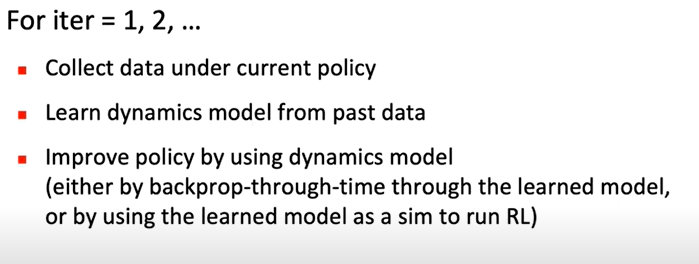
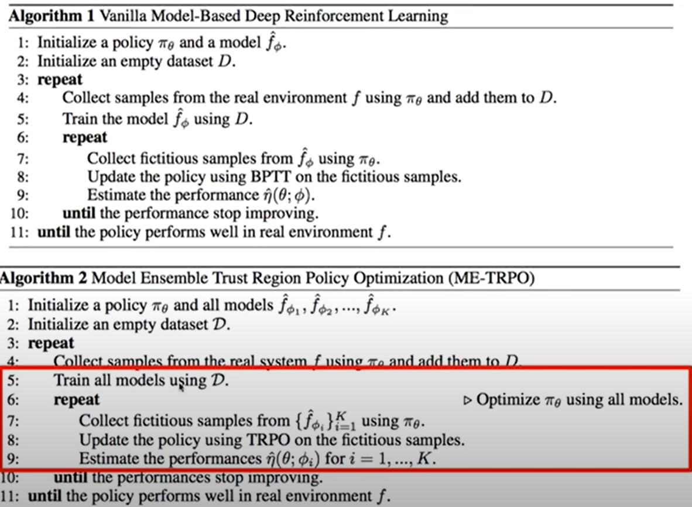
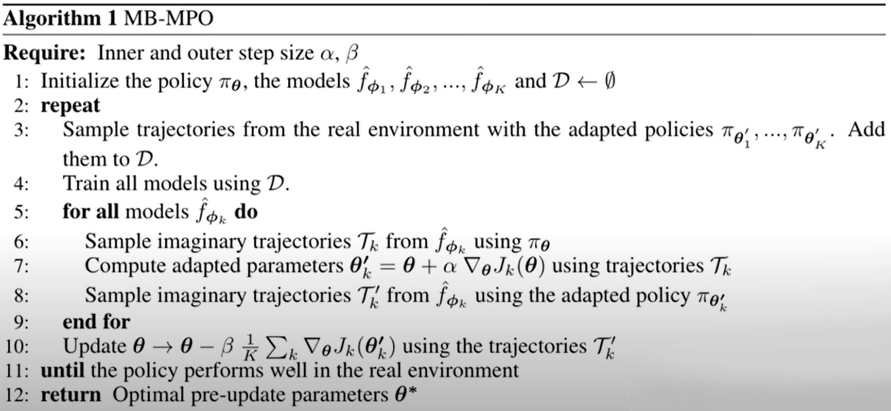

**[< Torna all'indice dei conenuti](../index.md)**

# Lecture 6 - Model-based RL

Fin'ora, si sono trattati model-free RL methods. Si può fare in modo di creare una rappresentazione interna dell'ambiente dai dati che l'agente colleziona.

## Model-based RL

Osservazioni:

- si migliora la policy ad ogni passo, oltre a modellare il dynamic model dai dati raccolti
- anticipa la raccolta dati: si potrebbe fare update della policy in maniera più significativa che con il gradiente sui dati raccolti
- si potrebbe usare il modello appreso in altri task simili
- molto sample-efficient

Perché non usarlo sempre?

- tecnica non matura
- spesso non serve imparare l'ambiente (in robotica si però)
- può essere instabile
- spesso non ottiene le stesse performance asintotiche di altri metodi model-free

## Robust Model-Based RL: Model_Ensemble TRPO (ME-TRPO)

Standard overfitting (supervised): buone performance in training ma cattive in testing.

Model-bias:

- nuovo overfitting che appare nei model-based methods
- l'ottimizzazione della policy sfrutta regioni dove i dati non sono sufficienti per apprendere il modello: l'algoritmo pensa di ottenere alto reward da zone modellate con pochi dati
- questo risulta in policy pessime
- fix proposto: ME-TRPO

## ME-TRPO

Model ensemble: più modelli per avere performance più solide.

Osservazioni:

- si collezionano esempi fittizi dai modelli e si fa update della policy
- si stimano le performance su più membri dell'ensemble
- se ci sono abbastanza dati per supportare un modello, tanti membri dell'ensemble concorderanno; altrimenti, ci sarà più confusione, quindi probabilmente si è fuori dalla trust region

Risultati:

- ME-TRPO ha buone learning curves
- meglio di BPTT

## Adaptive Model-based RL: Model-Based Meta-Policy Optimization (MB-MPO)

Possiamo imparare qualcosa che si può applicare al mondo reale? quindi molto solido e generale? Possiamo aggiungere adaptiveness

Soluzioni:

- imparare un dynamic model migliore: difficile e fin'ora con risultati non soddisfacenti
- model-based RL tramite meta-policy optimization: adattarsi velocemente ad un ambiente che varia
  - basato su ensemble che impara come funziona il modo reale
  - si impara una **adaptive policy** che può velocemente adattarsi ad uno dei modelli appresi

Osservazioni chiave:

- apprendimento ensemble
- per ogni modello si fa un sample di traiettoria
- si fa uno step di ottimizzazione con gradiente con le traiettorie calcolate, se la policy corrente performa bene sulle traiettorie calcolate

Risultati:

- metodo molto sample-efficient: impara prima
- asintoticamente, performa in maniera uguale ai metodi model-free: ME-TRPO no
